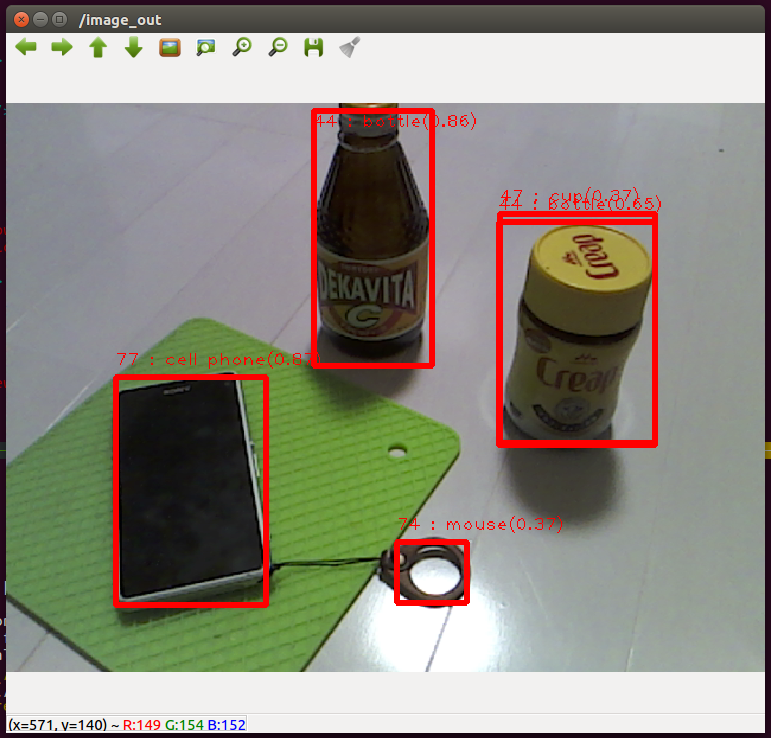

# TensorFlow Object Detector ROS Node

A ROS node using TensorFlow Object Detection C API.
This repository includes TensorFlow 1.11.0 library and works without any additional setup for TensorFlow library.



## How to build?

### setup ROS 
see http://wiki.ros.org/Installation

### setup catkin workspace
```
mkdir -P ~/catkin_ws/src
cd ~/catkin_ws
catkin init
```

### clone this repository
```
cd ~/catkin_ws/src
git clone <repository_path>
```
This may take few minutes for downloading tensorflow library and models.

### install prerequisite packages
Install USB camera node.
```
sudo apt-get install ros-<ros_distro>-usb-cam
```

### build
```
catkin build
```

## How to run?

```
cd ~/catkin_ws
source devel/setup.bash
roslaunch tensorflow_object_detector object_detection.launch
```
